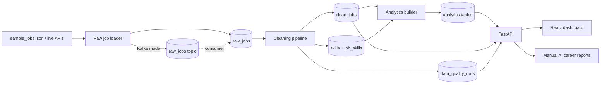

# StackRadar

StackRadar is a market-backed career intelligence platform for developers. It collects job postings, cleans them, extracts role-skill demand, checks data quality, and turns that into personal career plans and AI-generated roadmaps.

This version is a portfolio-grade local data platform, not a live SaaS. The structure is intentionally clean so users, paid plans, BYOK AI features and managed plans can be added later without rewriting the core pipeline.

## Why It Matters

Early-career candidates often guess which skills matter. StackRadar turns job posts into evidence: demanded skills, role patterns, salary coverage, remote availability and data quality signals.

## Architecture

## Cleaning Rules

StackRadar normalizes role titles, detects seniority and work mode from titles/descriptions, parses basic city/country values, parses common salary formats, extracts skills through aliases and removes duplicates before analytics are built.

The API also derives a lightweight classification confidence layer for job evidence. Non-technical title signals, missing skills, unknown roles and suspicious role/title mismatches lower confidence. Strong extracted technical skills raise confidence. The Jobs and Pipeline lenses use this to surface postings that need review instead of hiding noisy data.

