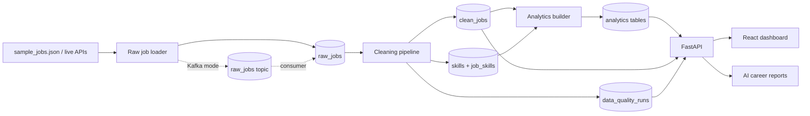

# StackRadar

StackRadar is a local-first job-market intelligence platform for students, junior developers, career switchers and career coaches. It collects messy job posts, stores raw data, cleans and normalizes it, extracts skills, builds analytics and displays the results in a polished React dashboard.

This version is a portfolio-grade local data platform, not a live SaaS. The structure is intentionally clean so users, paid plans, BYOK AI features and managed plans can be added later without rewriting the core pipeline.

## Why It Matters

Early-career candidates often guess which skills matter. StackRadar turns job posts into evidence: demanded skills, role patterns, salary coverage, remote availability and data quality signals.

## Features

- FastAPI backend with SQLAlchemy and Pydantic schemas
- PostgreSQL storage for raw jobs, clean jobs, skills, analytics and quality runs
- Optional Kafka event ingestion for raw job events
- Optional Airflow DAG for local orchestration
- Manual AI career intelligence with Mock and Gemini providers
- Messy sample dataset with 105 realistic postings
- Live API collectors for Remotive and Adzuna
- Cleaning pipeline for titles, roles, seniority, work mode, location and salary
- Dictionary-based skill extraction with normalized aliases
- Duplicate detection using source IDs and content fingerprints
- Analytics endpoints for overview, skills, roles, trends and skill gaps
- Career intelligence workspace with source freshness, source filters and API-backed analytics
- Docker Compose local setup with Postgres, Redis, Kafka, API and web app

## Architecture



## Tech Stack

Frontend: React, TypeScript, Vite, Tailwind CSS, Recharts, Framer Motion, TanStack Query, Lucide React.

Backend: Python, FastAPI, SQLAlchemy, Pydantic, PostgreSQL, Uvicorn.

Data: Python, Pandas-ready environment, regex cleaning, dictionary skill extraction.

Infrastructure: Docker, Docker Compose, PostgreSQL, optional Redis.

## Local Setup

Start services from the repository root:

```bash
docker compose -f infra/docker-compose.yml up --build
```

Seed repeatable demo data after Postgres is running:

```bash
bash scripts/seed.sh
```

Windows PowerShell equivalent:

```powershell
.\scripts\seed.ps1
```

Collect live API data:

```bash
bash scripts/collect-live.sh
```

PowerShell:

```powershell
.\scripts\collect-live.ps1
```

By default this fetches Remotive and Adzuna. Remotive needs no key. Adzuna is skipped unless `ADZUNA_APP_ID` and `ADZUNA_APP_KEY` are set.

Kafka demo mode publishes events first, then consumes them into Postgres:

```bash
bash scripts/collect-live.sh --mode kafka
bash scripts/kafka-consume.sh
```

Airflow is optional and runs behind a Docker Compose profile:

```bash
bash scripts/airflow-up.sh
```

PowerShell:

```powershell
.\scripts\airflow-up.ps1
```

Open:

- Dashboard: http://localhost:5173
- API: http://localhost:8000
- API docs: http://localhost:8000/docs
- Airflow, when enabled: http://localhost:8080
- PostgreSQL: localhost:5432

Reset the database volume:

```bash
bash scripts/reset-db.sh
```

PowerShell:

```powershell
.\scripts\reset-db.ps1
```

## Folder Structure

The repository follows the requested `apps`, `pipelines`, `infra`, `docs` and `scripts` layout. The only improvement is keeping reusable frontend primitives under `components/ui` and business pages under `pages`, which keeps UI files small and easier to scan.

## API Endpoints

- `GET /health`
- `GET /jobs`
- `GET /jobs/{job_id}`
- `GET /jobs/search?query=&role=&skill=&work_mode=&seniority=`
- `GET /analytics/overview`
- `GET /analytics/top-skills`
- `GET /analytics/top-roles`
- `GET /analytics/work-modes`
- `GET /analytics/seniority`
- `GET /analytics/role/{role}`
- `GET /analytics/skill-trends`
- `GET /analytics/sources`
- `POST /analytics/skill-gap`
- `GET /quality/summary`
- `GET /quality/issues`
- `GET /quality/pipeline-runs`
- `GET /quality/source-health`
- `GET /quality/validations`
- `GET /ai/status`
- `POST /ai/career-report`
- `POST /ai/learning-roadmap`
- `POST /ai/project-suggestions`
- `POST /ai/role-fit`
- `POST /ai/skill-gap-brief`
- `GET /ai/reports`
- `GET /ai/usage`

## Dashboard Pages

- Market Overview
- Skills Intelligence
- Role Analyzer
- Skill Gap Checker
- Intelligence
- Data Quality Monitor
- Jobs Explorer

## Cleaning Rules

StackRadar normalizes role titles, detects seniority and work mode from titles/descriptions, parses basic city/country values, parses common salary formats, extracts skills through aliases and removes duplicates before analytics are built.

## Data Sources

Demo mode uses `pipelines/collectors/sample_jobs.json` and stores jobs as source `sample`.

Live mode supports:

- Remotive API: no API key required, source `remotive`.
- Adzuna API: requires `ADZUNA_APP_ID` and `ADZUNA_APP_KEY`, source `adzuna`.

Set optional environment values in `infra/.env.example`:

```bash
AI_PROVIDER=mock
GEMINI_API_KEY=
GEMINI_MODEL=gemini-1.5-flash
PIPELINE_MODE=direct
KAFKA_BOOTSTRAP_SERVERS=localhost:9092
ADZUNA_APP_ID=
ADZUNA_APP_KEY=
ADZUNA_COUNTRY=gb
DEFAULT_JOB_QUERY=software developer
LIVE_COLLECT_LIMIT=1000
```

Remotive jobs should link back to their source URL if displayed publicly.

Troubleshooting:

- Missing Adzuna keys: expected; Adzuna will be skipped and Remotive can still collect.
- API request failed: retry with a smaller limit or broader query.
- No jobs inserted: likely duplicate source IDs already exist.
- Kafka unavailable: use direct mode; the collector defaults to direct database writes.
- Airflow too heavy locally: leave the profile off and use the scripts directly.
- Gemini unavailable: use Mock mode; it is the default and does not require a key.
- Need a clean run: reset the DB, restart Docker, then run `scripts/seed.sh` or `scripts/collect-live.sh`.

## Screenshots

Add screenshots here after running the local dashboard:

- Overview dashboard
- Role analyzer
- Skill gap checker
- Jobs explorer

## Future Roadmap

- Authentication and saved workspaces
- User-uploaded job datasets
- AI career reports with BYOK keys
- Managed AI plan using platform keys
- Payment webhooks and subscriptions
- Background jobs for scheduled refreshes
- Managed scheduling and hosted pipeline workers

## SaaS Plan Idea

Free users can inspect limited processed intelligence. BYOK users provide their own AI key for enhanced extraction. Managed users use platform-managed AI capacity. Paid users access processed intelligence, not separate pipeline forks.

## What This Project Proves

StackRadar demonstrates data collection, raw storage, cleaning, processing, skill extraction, role normalization, salary parsing, duplicate detection, data quality monitoring, analytics, a backend API, a modern dashboard and local Docker-based delivery.
