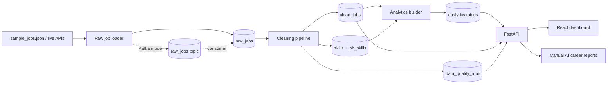

# StackRadar

StackRadar is a market-backed career intelligence platform for developers. It collects job postings, cleans them, extracts role-skill demand, checks data quality, and turns that into personal career plans and AI-generated roadmaps.

This version is a portfolio-grade local data platform, not a live SaaS. The structure is intentionally clean so users, paid plans, BYOK AI features and managed plans can be added later without rewriting the core pipeline.

## Why It Matters

Early-career candidates often guess which skills matter. StackRadar turns job posts into evidence: demanded skills, role patterns, salary coverage, remote availability and data quality signals.

## Features

- Dark graphite career operating system UI with seven product lenses
- Market Lens: strongest role, skill, access and confidence signals
- Skills Lens: skill demand ranking, category groups and portfolio signals
- Roles Lens: target-role blueprint with core stack, support stack and market conditions
- Jobs Lens: compact evidence rows with classification confidence and source details
- Career Plan Lens: deterministic fit analysis plus manual Mock/OpenRouter report generation
- AI Reports Lens: report archive with provider, cache and quota metadata
- Pipeline Lens: data trust center for freshness, cleanliness and known limits
- FastAPI backend with SQLAlchemy and Pydantic schemas
- PostgreSQL storage for raw jobs, clean jobs, skills, analytics and quality runs
- Optional Kafka event ingestion for raw job events
- Optional Airflow DAG for local orchestration
- Manual AI career intelligence with Mock and OpenRouter providers
- Messy sample dataset with 105 realistic postings
- Live API collectors for Remotive and Adzuna
- Cleaning pipeline for titles, roles, seniority, work mode, location and salary
- Dictionary-based skill extraction with normalized aliases
- Duplicate detection using source IDs and content fingerprints
- Analytics endpoints for overview, skills, roles, trends and skill gaps
- Career intelligence workspace with source freshness, source filters and API-backed analytics
- Docker Compose local setup with Postgres, Redis, Kafka, API and web app

## Architecture



## Tech Stack

Frontend: React, TypeScript, Vite, Tailwind CSS, Recharts, Framer Motion, TanStack Query, Lucide React.

Backend: Python, FastAPI, SQLAlchemy, Pydantic, PostgreSQL, Uvicorn.

Data: Python, Pandas-ready environment, regex cleaning, dictionary skill extraction.

Infrastructure: Docker, Docker Compose, PostgreSQL, optional Redis.

## Local Setup

Start services from the repository root:

```bash
docker compose -f infra/docker-compose.yml up --build
```

Seed repeatable demo data after Postgres is running:

```bash
bash scripts/seed.sh
```

Windows PowerShell equivalent:

```powershell
.\scripts\seed.ps1
```

Collect live API data:

```bash
bash scripts/collect-live.sh
```

PowerShell:

```powershell
.\scripts\collect-live.ps1
```

By default this fetches Remotive and Adzuna. Remotive needs no key. Adzuna is skipped unless `ADZUNA_APP_ID` and `ADZUNA_APP_KEY` are set.

AI is optional and backend-only. Mock is the default. To try OpenRouter, add these placeholders to `infra/.env` and fill only the key locally:

```bash
AI_PROVIDER=mock
OPENROUTER_API_KEY=
OPENROUTER_MODEL=openrouter/auto
OPENROUTER_SITE_URL=http://localhost:5173
OPENROUTER_APP_NAME=StackRadar
```

OpenRouter is never called on page load, navigation, fit analysis or report history. It is used only after selecting OpenRouter and clicking a manual Generate action in the Career Plan flow.

Every deterministic output is labeled `AI used: No` with StackRadar analytics as the source. Every generated report is labeled with provider, cache state and source data. Viewing history and changing provider filters are read-only.

Kafka demo mode publishes events first, then consumes them into Postgres:

```bash
bash scripts/collect-live.sh --mode kafka
bash scripts/kafka-consume.sh
```

Airflow is optional and runs behind a Docker Compose profile:

```bash
bash scripts/airflow-up.sh
```

PowerShell:

```powershell
.\scripts\airflow-up.ps1
```

Open:

- Dashboard: http://localhost:5173
- API: http://localhost:8000
- API docs: http://localhost:8000/docs
- Airflow, when enabled: http://localhost:8080
- PostgreSQL: localhost:5432

Reset the database volume:

```bash
bash scripts/reset-db.sh
```

PowerShell:

```powershell
.\scripts\reset-db.ps1
```

## Cleaning Rules

StackRadar normalizes role titles, detects seniority and work mode from titles/descriptions, parses basic city/country values, parses common salary formats, extracts skills through aliases and removes duplicates before analytics are built.

The API also derives a lightweight classification confidence layer for job evidence. Non-technical title signals, missing skills, unknown roles and suspicious role/title mismatches lower confidence. Strong extracted technical skills raise confidence. The Jobs and Pipeline lenses use this to surface postings that need review instead of hiding noisy data.

